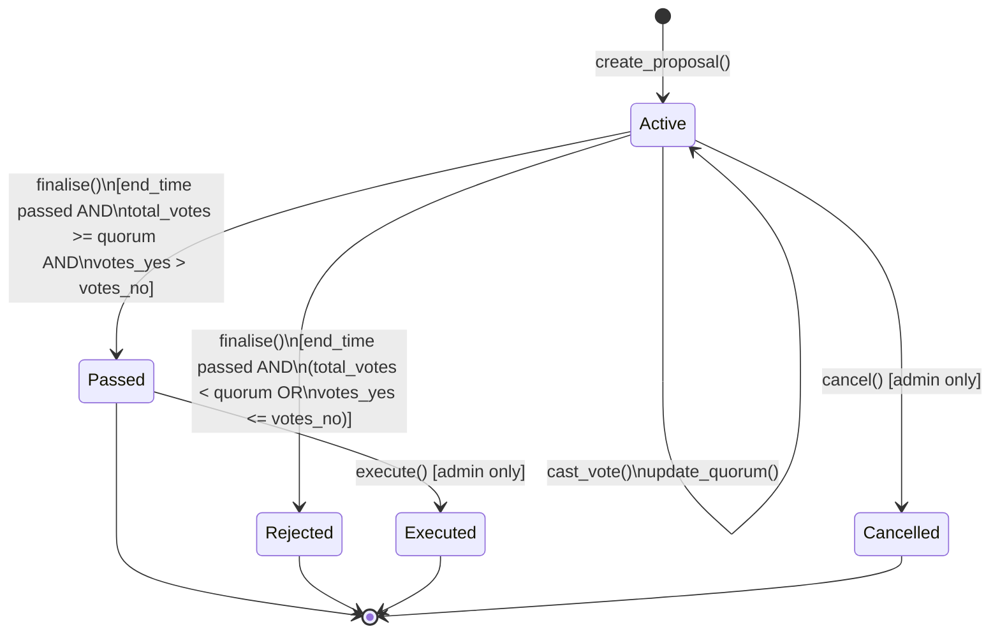

# Proposal Lifecycle

## State Diagram



---

## States

| State | Description |
|-------|-------------|
| **Active** | The proposal is open for voting. Votes can be cast and the quorum can be adjusted by the admin. This is the only mutable state. |
| **Passed** | The voting period ended, quorum was met, and `votes_yes > votes_no`. The proposal is awaiting execution. |
| **Rejected** | The voting period ended but either quorum was not met or `votes_yes <= votes_no`. Terminal state. |
| **Executed** | The admin has marked the passed proposal as executed. Terminal state. |
| **Cancelled** | The admin cancelled the proposal before the voting period ended. Terminal state. |

---

## Transitions

### `create_proposal()` → Active
Any address can create a proposal by supplying a title, description, quorum threshold, and duration. The proposal's `end_time` is set to `ledger_timestamp + duration` at creation time.

### `cast_vote()` — Active stays Active
Any token holder can vote Yes, No, or Abstain while the proposal is Active and the voting window is open. Vote weight equals the voter's current token balance. The tally is updated in place; the status does not change.

### `update_quorum()` — Active stays Active
The admin can raise or lower the quorum threshold on an Active proposal at any time before finalisation.

### `finalise()` → Passed or Rejected
Anyone can call `finalise()` once `ledger_timestamp > end_time`. The outcome is determined atomically:

```
total_votes = votes_yes + votes_no + votes_abstain

if total_votes >= quorum AND votes_yes > votes_no → Passed
else                                               → Rejected
```

### `execute()` → Executed
Only the admin can call `execute()` on a Passed proposal. This is a bookkeeping step; any real on-chain side-effects must be handled by the calling application.

### `cancel()` → Cancelled
Only the admin can cancel an Active proposal. Cancellation is immediate and permanent regardless of how many votes have been cast.

---

## Edge Cases

**Tie vote (`votes_yes == votes_no`)**
The condition requires `votes_yes > votes_no` (strict majority). A tie resolves as Rejected, even if quorum is met.

**Abstain votes count toward quorum but not outcome**
Abstain votes are included in `total_votes` for quorum calculation but do not influence the yes/no comparison. A proposal can reach quorum entirely through Abstain votes and still be Rejected.

**Zero token balance**
`cast_vote()` reverts with `NoVotingPower` if the voter's token balance is zero at the time of the call. The balance is snapshotted at vote time and stored; see ADR-003.

**Double voting**
Each address may vote exactly once per proposal. A second call reverts with `AlreadyVoted`.

**Finalise before end_time**
`finalise()` reverts with `VotingStillOpen` if called before `end_time`. There is no early-close mechanism.

**Voting after end_time**
`cast_vote()` reverts with `VotingPeriodEnded` if called after `end_time`, even if `finalise()` has not been called yet.

**Executing a Rejected or Cancelled proposal**
`execute()` requires `ProposalStatus::Passed`. Calling it on any other status reverts with `ProposalNotPassed`.

**Cancelling a non-Active proposal**
`cancel()` requires `ProposalStatus::Active`. Attempting to cancel a Passed, Rejected, Executed, or already-Cancelled proposal reverts with `ProposalNotActive`.
